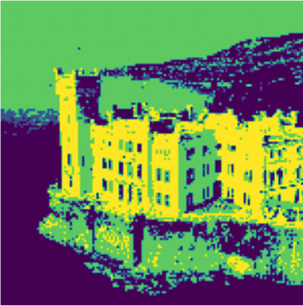

# Dirichlet process mixture models

## Introduction
Dirichlet process mixture models (DP-MM) are a generalization of the [Dirichlet process](https://en.wikipedia.org/wiki/Dirichlet_process) to multiple components. The Dirichlet process is a probabilistic model that assumes that a finite number of independent random variables are drawn from a distribution. The DP-MM model assumes that a finite number of independent random variables are drawn from a distribution that is a mixture of Dirichlet processes. 

## The Gaussian mixture models
The gaussian mixture distribution is defined as follows:
$$ p(\underbar{x}) = \sum_{i}^{K}\pi_k \mathcal{N}(\underbar{x} |\mu_i,\Sigma_i) $$
Where $K$ is the number of clusters. We define a variable $\underbar{z}$ in which exists only one $k$ s.t $z_k = 1$ while $z_{\neg k} = 0$. We define 
$$ p(z_k == 1) = \pi_k $$
So it must follow that:
$$ \sum_{i}^{K}\pi_k = 1 $$
$$ 0 \leq \pi_k \leq 1 $$
and
$$ p(\underbar{z}) = \prod_{i}^{K} \pi_{k}^{z_k} $$
We can express the conditional probability of $\underbar{x}$ given $\underbar{z}$ as:
$$ p(\underbar{x}|\underbar{z}) = \prod_{i}^{K}\mathcal{N}(\underbar{x} |\mu_i,\Sigma_i)^{z_k} $$
and so from the joint probability $p(\underbar{z})p(\underbar{x}|\underbar{z})$ we obtain by marginalization:
$$ p(\underbar{x}) = \sum_{\underbar{z}}p(\underbar{z})p(\underbar{x}|\underbar{z}) =  \sum_{i}^{K}\pi_k \mathcal{N}(\underbar{x} |\mu_i,\Sigma_i) $$

So far, we have introduced for each datapoint $\underbar{x}_i$ a corrisponding latent variable $\underbar{z}_i$ that specify the cluster to which it belongs.
We have therefore found an equivalent formulation of the Gaussian mixture in-
volving an explicit latent variable.
Another quantity we will use is the conditional probability of $\underbar{z}$ given $\underbar{x}$:
$$ \gamma(z_k)= p(z_k |\underbar{x})=\dfrac{p(z_k=1)p(\underbar{x}|z_k}{\sum_{i}^K p(z_i=1)p(\underbar{x}|z_i=1)} = \dfrac{\pi_k\mathcal{N}(\underbar{x}|\mu_k,\Sigma_k)}{\sum_{i}^K\pi_i\mathcal{N}(\underbar{x}|\mu_i,\Sigma_i)} $$

We shall view $\pi_k$ as the probability of $z_k=1$ and $\gamma(z_k)$ as the probability of $z_k$ given $\underbar{x}$.

## The dirichlet process

### Intuitive definition
Suppose we have a succession of value $X_1,X_2,..$ generated accordly the following algorithm (Chinese resturant process) in a rich get richer fashion :

Let be $H$ a probability distribution and $\alpha$ a parameter.
For $n\geq 1$:
- Draw $X_n$ from $H$ with probability $\dfrac{\alpha}{\alpha+n-1}$
- Set $X_n = x$ with probability $\dfrac{n_x}{\alpha+n-1}$. Where $n_x$ is the number of times $x$ has been drawn from $H$, i.e. $n_x := \#\{j : X_j=x ,\, j<n \}$

The $X_1, X_2,..$ are not indipendent but they are exchangeable. This fact can be shown by calculating the joint probability distribution of the observations and noticing that the resulting formula only depends on which $x$ values occur among the observations and how many repetitions they each have. So for the De Finetti's theorem $X_1,X_2..$ are conditionally indipendent given a (latent) distribution $P$. This $P$ is a random variable itself and is called Dirichlet Process, i.e. $P\sim DP(H,\alpha)$.

### Formal definition
The dirichlet process $DP(H,\alpha)$ is a stochastic process where the realizations are a probability distribution over a measurable set $S$ such that for any measurable finite partition of $S=\bigcup B_i$ :
$$ G \sim DG(H,\alpha)$$
$$ (G(B_1), G(B_2),\dots,G(B_n)) \sim Dir \left( \alpha H(B_1),\alpha H(B_2),\dots, \alpha H(B_n) \right)$$ 

### Dirichlet process mixture models
Consider the model 
$$ G \sim DP(\alpha,G_0) $$
$$ \theta_i \sim G $$
Marginalizing out the random distribution the joint distribution of n replicates $\theta_i$ is:
$$ p(\theta_1 \dots \theta_n | G_0, \alpha) = \int \left( \prod_{i=1}^n G(\theta_i) \right) P(G) dG $$
Now conditionig $\theta_n$ on $\theta_1 \dots \theta_{n-1}$ we have:
$$ \theta_n | \theta_1 \dots \theta_{n-1} \sim \dfrac{1}{\alpha + n -1}\sum_{i=1}^{n-1}\delta_{\theta_i} + \dfrac{\alpha}{\alpha+n-1} $$
This equation reveals the clustering property of the joint distribution: there is a positive probability that each $\theta_i$ will take one the value of another $\theta_j$, leading some of the variables to share values. This equation shows also the roles of the scaling parameters $\alpha$. Greater $\alpha$ means that, for $\theta_n$ is more likely to have a newly draw from $G_0$ rather than take on one of the values from $\theta_{1:n-1}$.

In a DP mixture models (gaussian), $\theta_i$ is the latent variable that parametrizes the distribution of an observed data point : 
$$ P \sim DP(\alpha, G_0)$$
$$ \Theta_i \sim P $$
$$ x_i | \theta_i \sim \mathcal{N}(\cdot|\theta_i) $$

Now consider the posterior distribution of $\theta_{1:n}$ given $x_{1:n}$. Because of the clustering propriety, observations are grouped according to theri shared parameters. Unlike finite clustering models, the DP mixture models are not restricted to finite clusters.

# Result
 

